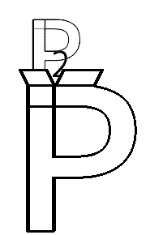

# Parts To Purpose

**Team** `SciFly`

- Tony Lockhart
- Phillip Grider
- Mary Nguyen
- Nathan Kloer
- Komal Batra

---
### IMPORTANT LINKS
* [Link to github repository](https://github.com/tlockhart/parts-2-purpose)

* [Link to Production Site](https://shielded-refuge-22847.herokuapp.com/)

---
### **About the site**

Many small nonprofits receive item donations from donors and distribute those items to people in need. A lot of these nonprofits operate on a shoestring budget and use basic tools such as Microsoft Excel, Word, and Outlook to manage their inventory, interact with donors, and distribute donations to donees. Their inventory, donees, and donor management are at times kept on multiple documents in different locations and managed by various volunteers which makes it difficult to update, maintain, access, and scale.

Our goal is to provide an IT solution that would make the process easier for small nonprofits to manage their donations so that they can spend more time working on their cause -- making a difference. Our app is called `Parts-to-Purpose`.  It is a simple inventory management platform for nonprofits that will allow them to:
- Update, manage, and track their inventory of donations
- Collect donor and donee information
- Provide donees a portal to login, view and select items needed, add to a cart, and -arrange for pickup/shipment of their cart
- See changes in inventory/stock in near real-time
- Collect and visualize metrics to identify needs and trends so that they can use those metrics to focus donation efforts or community marketing

---
### **Technologies Used**

- React
- HTML
- CSS
- Bootstrap
- MDBootstrap (Material Design for Bootstrap)
- RC Touchable (To enable touch capabilities on mobile devices)
- NodeMailer (To enable e-mails)
- Bcrypt (Login encryption)
- Express
- Mongoose /MongoDB
- Node
- Javascript/JQuery
- ESLint
- Heroku

---
### **Setup**

In order to run the app, you will need to clone this repository and install all required technologies listed below.

### **Required Technologies**

1. [Node.js LTS](https://nodejs.org/en/) 
2. [NPM](https://www.npmjs.com/get-npm) 
3. [Git & Git Bash](https://git-scm.com/downloads) 
4. [MongoDB](https://docs.mongodb.com/manual/tutorial/install-mongodb-on-windows/) 
5. [Robo 3T](https://robomongo.org/download) 

### **Installation Steps**

1. Open Bash and Clone the Parts2Purpose repo
2. Install all required technologies
3. [Optional] In Bash, change the current directory to the Parts2Purpose directory and install create-react-app module using the following command:
    1. npm install -g create-react-app
4. [Optional: Windows Users Only]  Run the following commands in powershell as an ADMINISTRATOR in the Parts2Purpose root directory.
    1. npm install node-pre-gyp -g
    2. [Close your IDE if open]
    3. npm install --global --production windows-build-tools
    4. npm install bcrypt
5. In Bash, change to the Parts2Purpose directory, install all modules from the package.json, using the following command:
    1. npm install [Enter]
6. Seed the database
    1. In Bash, execute the following commands from the Parts2Purpose root folder
    2. cd scripts
    3. node seedDb.js

### **Execute Program**

1. In Bash, enter the following command in the Parts2Purpose directory, to start the server.
    1. npm start [ENTER]
2. The application will open your browser and run the app in test mode:
    1. http://localhost:3000

### **Use**
This repo is available for public non-commercial use only.

### **Goal**
The goal of this project is to create and deploy a MERN application, consisting of a server and a Single Page Application (SPA), using React. The server stores and retrieves data from our API using MongoDB and displays content to the client, via the UI. The UI is broken into React components, that manage and transfer state, and responds to user events.
